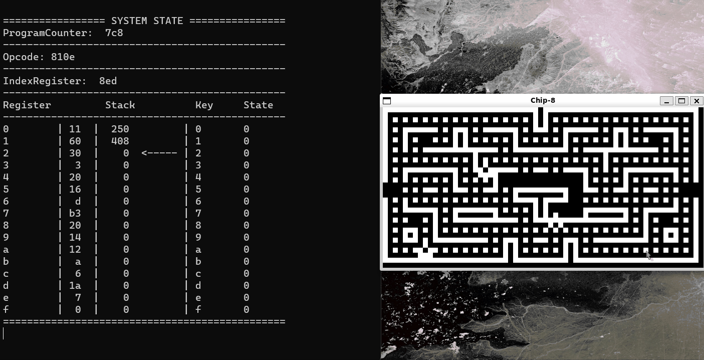

# Chip-8 Interpreter

    This is my chip-8 interpreter that I wrote in C. Chip-8 is a simple interpreted programming language that was used on diy computers in the late 70s and 80s. It is well documented online and a starting point into the world of emulation development.   
    During the development I relied on the following resources for guidance and I encourage you to do the same if you want to try to build a chip-8 interpreter. 

*http://devernay.free.fr/hacks/chip8/C8TECH10.HTM*

*https://tobiasvl.github.io/blog/write-a-chip-8-emulator/*

The keyboard for the chip-8 is a 16 key hexadecimal keyboard with the following layout.  

    key setup

    Keypad       Keyboard
    +-+-+-+-+    +-+-+-+-+
    |1|2|3|C|    |1|2|3|4|
    +-+-+-+-+    +-+-+-+-+
    |4|5|6|D|    |Q|W|E|R|
    +-+-+-+-+ => +-+-+-+-+
    |7|8|9|E|    |A|S|D|F|
    +-+-+-+-+    +-+-+-+-+
    |A|0|B|F|    |Z|X|C|V|
    +-+-+-+-+    +-+-+-+-+

It is also important to note that different programs for the chip-8 were intended to be run at different system speeds. I have allowed the user to mess with the system speed by pressing f1 (slowdown) and f2 (speedup). 

I have provided some game roms, random program roms, and the test roms I used in development. Currently my emulator seems to work with a majority of roms. Some roms however give my emulator issues and I have not completely tracked down the source of this issue yet but I believe that it has to do with different roms relying on slight variations in chip8 behavior across different implimentations (flag behavior, sprite wrap-around / clipping behavior, ... ). I would like to investigate these issues but I think that writing the emulator in a different language might be more fruitful and allow me to create a cleaner visual representation.

To run the emulator you will need SDL2 intalled on your system and the gcc compiler. You will additionally need to have ncurses on your system. This is included with most linux distros. I have provided a makefile for compilation. To run the program execute

---
./chip8 *romfile*

---

